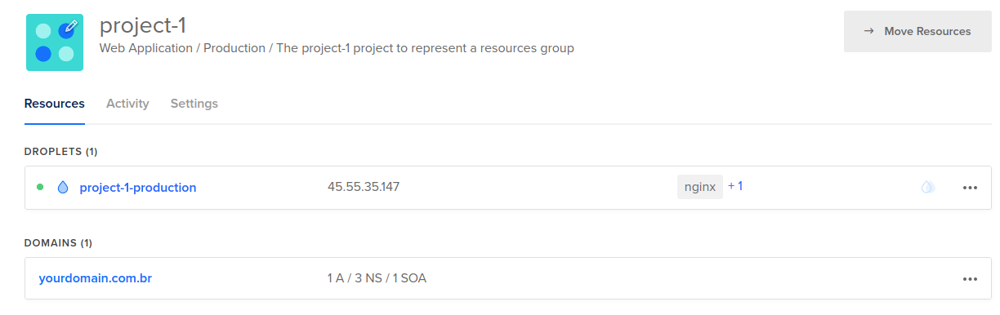
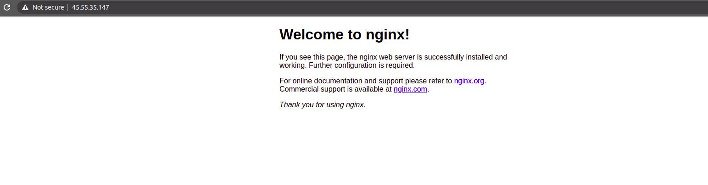
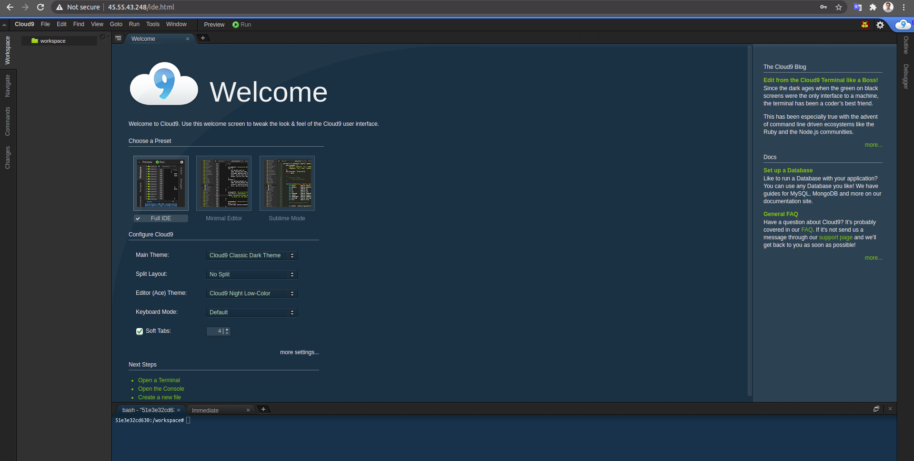

# p88
O projeto p88 um piano de 88 teclas,
onde cada nota soa individualmente
mas quando orquestradas acabam criando
uma harmonia :musical_keyboard:

O objetivo desse projeto é trazer mais harmonia e
tranquilidade para os devs usando *infra as code*,
que tem vários projetos e não conseguem mais ficar
criando e configurando servidores na mão :notes:

Nesse projeto vamos usar o provedor
[Digital Ocean](https://www.digitalocean.com),
com máquinas a partir de $5/mês :moneybag:

## Requisitos
Para rodar esse projeto, vamos usar o 
[docker](https://docker.com)
com a imagem base `debian stable-slim` :whale2:

# Projetos
O p88 é dividido em projetos,
podendo provisionar cada um individualmente.

No exemplo, vamos ter o `project-1`,
com dois ambientes `prod` e `stage`
e `project-2` com apenas `prod`.

```
├── project-1
│   ├── prod
│   │   ├── ansible
│   │   │   ├── ansible.cfg
│   │   │   ├── config.yml
│   │   │   └── playbook.yml
│   │   └── terraform
│   │       ├── locals.tf
│   │       ├── main.tf
│   │       └── variables.tf
│   └── staging
│       ├── ansible
│       │   ├── ansible.cfg
│       │   ├── config.yml
│       │   └── playbook.yml
│       └── terraform
│           ├── locals.tf
│           ├── main.tf
│           └── variables.tf
└── project-2
    └── deployment
        ├── ansible
        │   ├── ansible.cfg
        │   ├── config.yml
        │   └── playbook.yml
        └── terraform
            ├── locals.tf
            ├── main.tf
            └── variables.tf
```

## Terraform
Para criar a infraestrutura vamos utilizar o terraform.

No arquivo `locals.tf` são as variáveis que
serão utilizadas para criação da infra. Exemplo:
```
locals {
	env = "production"

	project = "project-1"
	project_purpose = "Web Application"
	domain = "yourdomain.com.br"
	droplet_image = "ubuntu-18-04-x64"
	droplet_region = "nyc3"
	droplet_size = "s-1vcpu-1gb"
	droplet_tags = ["nginx", "docker"]
}
```

No `main.tf`, são as definições dos recursos que serão criados:
```
provider "digitalocean" {
  token = var.do_token
  version = "1.12.0"
}

module "droplet" {
  source = "/p88/lib/terraform/modules/droplet"

  name = local.project
  env = local.env
  region = "${local.droplet_region}"
  image = "${local.droplet_image}"
  size = "${local.droplet_size}"
  tags = "${local.droplet_tags}"
  user = "${local.droplet_user}"
  user_pvt_key = "${var.pvt_key}"
  ssh_fingerprint = "${var.ssh_fingerprint}"
}

module "domain" {
  source = "/p88/lib/terraform/modules/domain"

  domain = local.domain
  ipv4 = module.droplet.ipv4
}

module "project" {
  source = "/p88/lib/terraform/modules/project"

  name = local.project
  env = local.env
  purpose = local.project_purpose
  resources   = [
    "${module.droplet.urn}",
    "${module.domain.urn}",
  ]
}
```

Nesse exemplo, criamos uma *droplet*, um *domain*
e relacionamos os dois a um *projeto* no Digital Ocean.

## Ansible
Vamos usar o ansible para configurar as *droplets*.

Exemplo do `config.yml`:
```yml
all:
  hosts:
    104.236.36.162
  vars:
    app: project-1
    env: production
    image: nginx:stable-alpine
```

Arquivo `playbook.yml` com exemplo de task:
```yml
tasks:
  - name: Create container
    tags: app
    docker_container:
      name: "{{ app }}"
      image: "{{ image }}"
      state: started
      ports:
        - 80:80

```

## Rodando o Projeto
Antes de executar os comandos `make`, você precisar
criar um *token* e um *fingerprint* na
[Digital Ocean](https://www.digitalocean.com).
Feito isso, vai precisar expotar essas variáveis para o ambiente.

```bash
export do_token=<coloque-seu-token-aqui>

export do_fingerprint=<coloque-seu-fingerprint-aqui>
```

Depois crie a imagem docker com o terraform e ansible, execute:
```bash
make build
```

Feito isso já é possível provisionar o ambiente usando terraform e ansible.

### Criando a infraestrutura com Terraform
Os comandos a baixo utilizam o terraform
para gerenciar a infraestrutura.

Para criar os recursos, execute:
```
make terraform-apply app=project-1 env=prod
```

Abrindo o Digital Ocean, podemos visualizar
os recursos criados.


Se precisar destruir os recursos, execute:
```
make terraform-destroy app=project-1 env=prod
```

### Provisionando com o Ansible
Com a *droplet* criada vamos provisionar usando ansible.

Para provisionar todo o ambiente do projeto, execute:
```
make ansible app=project-1 env=prod
```

Acessando o endereço ip da *droplet* já é possível acessar a aplicação.


Se precisar especificar uma task, utilize a variável `tags`,
conforme o exemplo a baixo:
```bash
make ansible app=project-1 env=prod tags=app
```

## Testando
Para verificar o funcionamento da droplet, entre via ssh e liste
os container em execução:

```bash
> ssh 45.55.35.147 -l root

Welcome to Ubuntu 18.04.5 LTS (GNU/Linux 4.15.0-121-generic x86_64)

 * Documentation:  https://help.ubuntu.com
 * Management:     https://landscape.canonical.com
 * Support:        https://ubuntu.com/advantage

root@project-1-production:~# docker ps
CONTAINER ID   IMAGE                 COMMAND                  CREATED          STATUS          PORTS                NAMES
863f134396b5   nginx:stable-alpine   "/docker-entrypoint.…"   47 seconds ago   Up 45 seconds   0.0.0.0:80->80/tcp   project-1
```

Acessando o `project-2`

